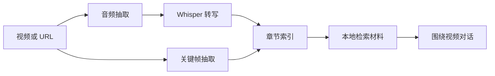
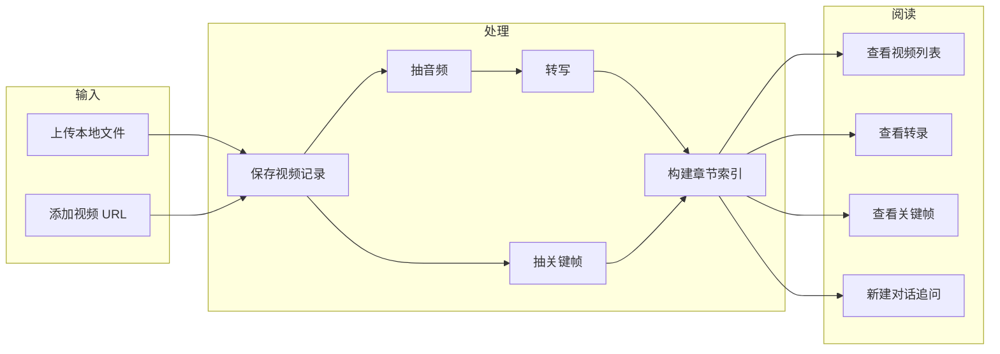

<div align="center">

# video-reader

*把长视频变成可阅读、可检索、可追问的本地知识材料。*

[](https://www.python.org/)
[](https://fastapi.tiangolo.com/)
[](https://github.com/SYSTRAN/faster-whisper)
[](#)

> **视频转写** | **关键帧索引** | **章节化阅读** | **对话式追问** | **本地数据沉淀**

</div>

---

## 痛点

长视频不是不能看，而是很难反复使用。

| 场景 | 结果 |
| --- | --- |
| 课程、访谈、直播动辄几个小时 | 看完以后很难定位某个观点出现在哪一段 |
| 只有视频文件，没有结构化材料 | 想复盘只能拖进度条，效率很低 |
| 只做转写不看画面 | PPT、代码、图示、现场演示这些关键信息会丢 |
| 把整段转录直接塞给模型 | 上下文长、噪声多，回答容易漂 |
| 本地试用工具越改越散 | 数据、索引、对话、Provider 配置需要稳定沉淀 |

`video-reader` 的目标是把视频拆成可复查的材料：文本、关键帧、章节索引、检索入口和对话上下文都留在本地，后续可以围绕同一个视频持续追问。

---

## 核心思想

`video-reader` 不是单纯的“视频转文字”，而是把视频处理成一个可阅读文件夹。



| 模块 | 作用 |
| --- | --- |
| 转写 | 把音视频内容转换成带时间线的文本 |
| 抽帧 | 保留画面证据，覆盖 PPT、代码、图示、演示过程 |
| 索引 | 把长视频切成章节，生成 overview、chapter、search index |
| 对话 | 读取视频索引和转录材料，回答和当前视频相关的问题 |
| 日志 | 按时间线记录关键执行内容，方便复查模型输入输出 |

---

## 当前版本原则

| 原则 | 说明 |
| --- | --- |
| 本地优先 | 视频、转录、关键帧、索引和对话数据默认落在本地 |
| 先处理材料，再问模型 | 不把原始长视频粗暴交给模型，而是先转写、抽帧、建索引 |
| 关键帧不能缺席 | 长视频理解不能只看字幕，画面材料要进入阅读链路 |
| 长任务少打扰 | 长视频处理走生产模式，减少热重载对任务的影响 |
| CPU 留余量 | 分段和抽帧并发按当前 CPU 压力动态收敛 |
| 文档进 `md/` | 改造计划、诊断记录和实现计划默认进入 `md/` |
| 运行数据不进 Git | `data/`、日志、缓存、截图、临时文件都不提交 |

---

## 工作流程



---

## 功能一览

| 功能 | 当前状态 |
| --- | --- |
| 本地音视频上传 | 支持常见视频、音频和 `.txt` |
| URL 添加 | 通过 `yt-dlp` 下载并处理公开视频 |
| Whisper 转写 | 使用 Faster Whisper，默认 CPU + int8 |
| 关键帧提取 | FFmpeg 抽帧，生成可浏览画面材料 |
| 长视频索引 | 生成章节、概览、检索索引和时间线日志 |
| 对话式阅读 | 基于当前视频材料进行问答 |
| Provider 管理 | 页面内添加、测试、设为默认 |
| 三栏阅读界面 | 视频源、对话、正文、关键帧并排工作 |

---

## 文件说明

| 路径 | 作用 |
| --- | --- |
| `backend/main.py` | FastAPI 应用入口和服务路由 |
| `backend/database.py` | SQLite 数据读写 |
| `backend/video_processor.py` | 下载、转码、分段、抽帧 |
| `backend/transcriber.py` | Whisper 转写 |
| `backend/video_indexer.py` | 长视频章节索引构建 |
| `backend/video_reader_tool.py` | 对话检索工具 |
| `backend/minimax_client.py` | OpenAI 兼容模型调用 |
| `static/index.html` | 前端页面骨架 |
| `static/css/style.css` | 前端样式 |
| `static/js/` | 前端交互、API 封装和 UI 渲染 |
| `scripts/` | 冒烟测试脚本 |
| `md/` | 项目计划、诊断、改造记录 |
| `md/api.md` | API 文档 |
| `data/` | 本地运行数据，默认不提交 |

---

## 安装与启动

### 方式一：本地运行

```bash
python -m venv venv
venv\Scripts\activate
python -m pip install --upgrade pip
pip install -r requirements.txt
copy .env.example .env
python start.py --prod
```

启动后访问：

```text
http://localhost:8000
```

### 方式二：Docker

```bash
docker compose up --build
```

---

## 配置说明

| 变量 | 说明 |
| --- | --- |
| `MINIMAX_API_KEY` | MiniMax 或兼容服务的 API Key |
| `MINIMAX_BASE_URL` | OpenAI 兼容接口地址 |
| `MINIMAX_MODEL` | 默认模型名 |
| `FRAME_INTERVAL_SEC` | 抽帧间隔 |
| `FRAME_MAX_COUNT` | 单个视频最多抽帧数 |
| `FRAME_SCALE` | 关键帧缩放宽度 |
| `FRAME_QUALITY` | FFmpeg JPG 质量 |
| `FFMPEG_PATH` | `ffmpeg` 可执行文件路径，已加入系统 PATH 时可留空 |
| `FFPROBE_PATH` | `ffprobe` 可执行文件路径，已加入系统 PATH 时可留空 |
| `WHISPER_MODEL_SIZE` | Whisper 模型大小 |
| `WHISPER_DEVICE` | `cpu` 或可用加速设备 |
| `WHISPER_COMPUTE_TYPE` | CPU 场景建议 `int8` |
| `UPLOAD_MAX_MB` | 上传大小上限 |
| `HOST` | 服务监听地址 |
| `PORT` | 服务端口 |

---

## FFmpeg 配置

`video-reader` 依赖 FFmpeg 做音频抽取、转码和关键帧提取。推荐使用系统 FFmpeg。

| 系统 | 配置方式 |
| --- | --- |
| Windows | 下载 FFmpeg，把 `bin` 目录加入系统 PATH，或在 `.env` 写入 `FFMPEG_PATH` / `FFPROBE_PATH` |
| macOS | `brew install ffmpeg` |
| Ubuntu/Debian | `sudo apt install ffmpeg` |
| Docker | 镜像构建时已安装 FFmpeg |

Windows `.env` 示例：

```text
FFMPEG_PATH=C:\ffmpeg\bin\ffmpeg.exe
FFPROBE_PATH=C:\ffmpeg\bin\ffprobe.exe
```

检查配置：

```bash
python start.py --check
```

---

## 使用方式

| 步骤 | 操作 |
| --- | --- |
| 1 | 启动服务后打开本地页面 |
| 2 | 上传视频文件，或粘贴视频 URL |
| 3 | 等待转写、抽帧和索引构建完成 |
| 4 | 在右侧查看关键帧和转录文本 |
| 5 | 新建对话，围绕当前视频追问 |
| 6 | 后续复查时从视频列表继续读取 |

---

## 数据与 Git 边界

| 类型 | 处理 |
| --- | --- |
| 源码、前端、配置模板、文档 | 提交 |
| `md/` 中的计划和诊断记录 | 提交 |
| `data/` 视频数据、转录、索引、关键帧 | 不提交 |
| `server.*.log` 和 `*.log` | 不提交 |
| 截图、临时样式、缓存、虚拟环境 | 不提交 |
| `.env` 和本地密钥 | 不提交 |

---

## 常用检查

```bash
python -m compileall backend scripts
git status --short
```

接口细节见：`md/api.md`

---

## 版权与许可证

| 项目 | 内容 |
| --- | --- |
| Copyright | Copyright 2026 mengsi16 |
| License | Apache License 2.0 |

完整许可证文本见：`LICENSE`
