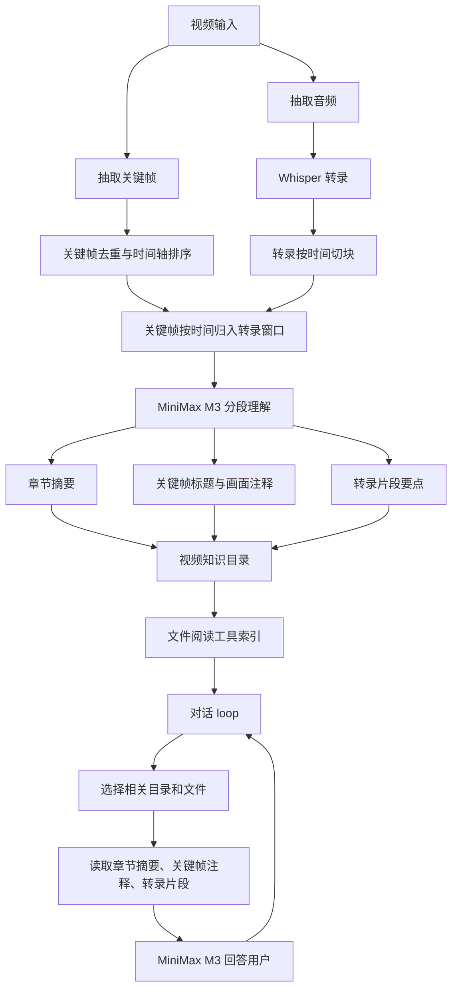
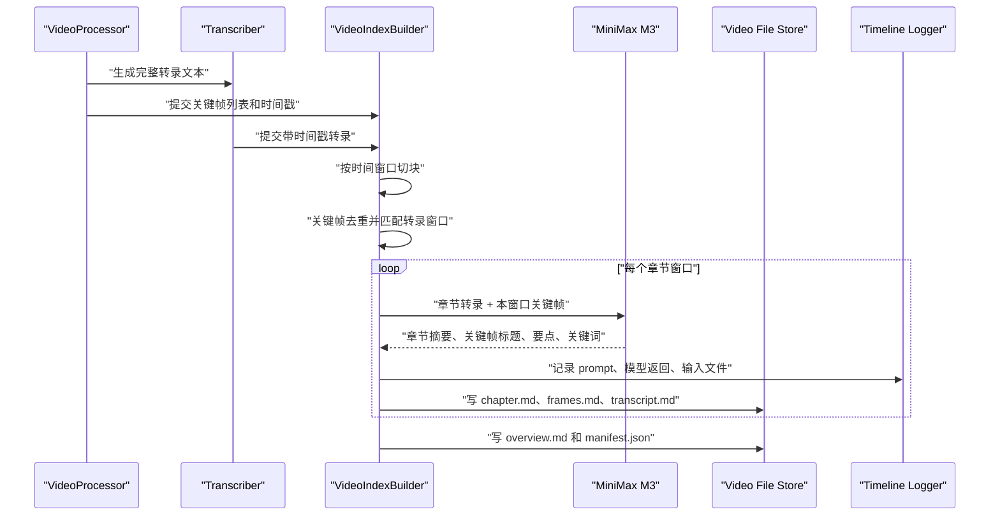
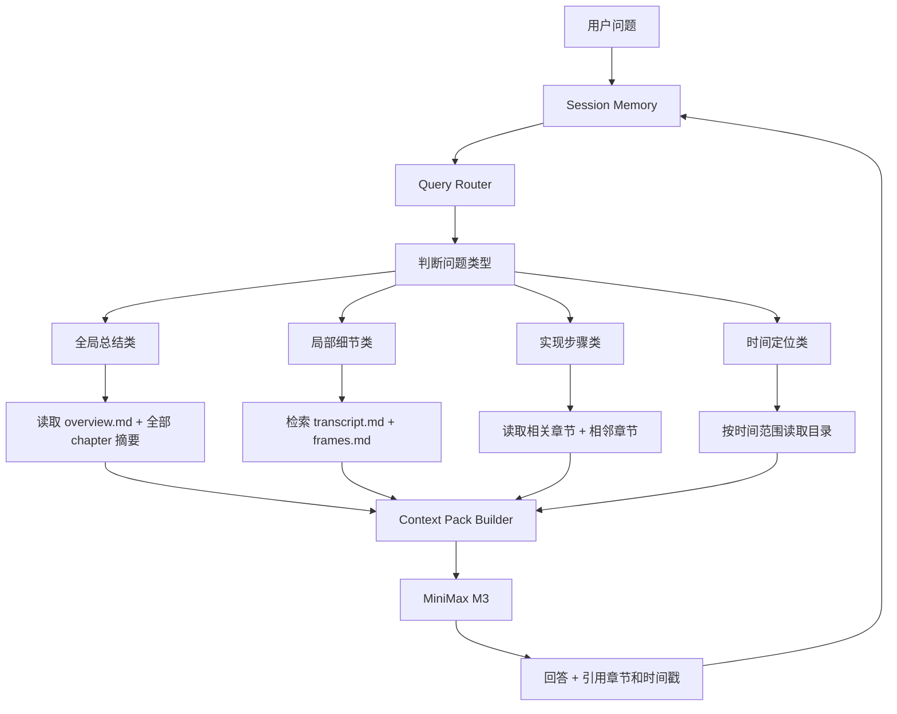

# 2026-06-17 长视频目录化文件阅读架构设计草案

## 目标

| 目标 | 说明 |
|---|---|
| 长视频完整覆盖 | 不再只把前 8000 字转录和前 20 帧送给模型 |
| 处理阶段先整理 | 转录和抽帧结束后，调用 MiniMax M3 分段理解、注释、摘要 |
| 文件系统可读 | 每个视频生成一个结构化目录，后续对话通过文件阅读工具读取 |
| loop 对话 | 用户连续追问时，保留已读目录、已选章节、已引用片段 |
| 降低上下文压力 | 对话时只注入相关章节摘要、相关转录块、相关关键帧注释 |

## 总体架构



## 目录结构

```text
data/video_indexes/{video_id}/
  manifest.json
  overview.md
  chapters/
    001_00-08_to_00-20/
      chapter.md
      transcript.md
      frames.md
      frames/
        frame_0001.jpg
        frame_0002.jpg
      model_calls.jsonl
    002_00-20_to_00-35/
      chapter.md
      transcript.md
      frames.md
      frames/
  search/
    lexical_index.json
    embeddings.jsonl
  logs/
    timeline.jsonl
```

## 处理流水线



## 对话 loop 架构



## 文件阅读工具接口

| 工具 | 输入 | 输出 |
|---|---|---|
| `list_video_index(video_id)` | 视频 ID | `overview`、章节列表、时间范围 |
| `read_video_overview(video_id)` | 视频 ID | 全局摘要、目录、主题索引 |
| `search_video_index(video_id, query)` | 查询文本 | 命中的章节、转录块、关键帧注释 |
| `read_video_chapter(video_id, chapter_id)` | 章节 ID | 章节摘要、关键帧注释、转录片段 |
| `read_video_time_range(video_id, start, end)` | 时间范围 | 对应转录、帧注释、章节摘要 |
| `build_context_pack(video_id, question, session_state)` | 问题和会话状态 | 送给模型的上下文包 |

## 推荐分块策略

| 数据 | 策略 |
|---|---|
| 转录 | 按 8 到 12 分钟切块，保留时间戳 |
| 关键帧 | 先按图片哈希和时间戳去重，再归入对应时间块 |
| 模型输入 | 每块转录加本块关键帧，逐块调用 MiniMax M3 |
| 章节合并 | 相邻块主题一致时合并成一个章节 |
| 全局摘要 | 用所有章节摘要再调用一次 MiniMax M3 生成 overview |

## 上下文包结构

```json
{
  "video_id": 4,
  "question": "这个 RAG 项目怎么实现？",
  "selected_chapters": ["003", "004", "005"],
  "context": {
    "overview": "...",
    "chapters": [
      {
        "chapter_id": "003",
        "time_range": "00:42:29-00:56:39",
        "summary": "...",
        "frame_notes": "...",
        "transcript_quotes": "..."
      }
    ]
  }
}
```

## 关键决策

| 决策 | 推荐 |
|---|---|
| 是否直接做向量库 | 第一版先做文件目录加关键词检索，后面再加 embedding |
| 是否一帧一帧看 | 对 PPT 课程可以一帧一帧注释，但要先去重 |
| 是否处理阶段调用 M3 | 推荐，这样对话时只读整理好的文档 |
| 是否保留原始转录 | 必须保留，回答要能引用原文时间戳 |
| 是否自动注入 | 推荐按问题动态注入，不把全部目录每次都塞进去 |

## 第一阶段实施边界

| 模块 | 第一阶段范围 |
|---|---|
| `VideoIndexBuilder` | 转录切块、关键帧去重、时间匹配 |
| `MiniMaxIndexer` | 分块调用 M3，生成章节摘要和帧注释 |
| `VideoFileStore` | 写入 `data/video_indexes/{video_id}` |
| `VideoReadTool` | 提供读取 overview、章节、搜索索引的函数 |
| Chat 接入 | 对话前先调用 `build_context_pack()`，再发给模型 |

## 风险

| 风险 | 处理 |
|---|---|
| 调用次数变多 | 串行或低并发处理，避免吃满 CPU 和网络 |
| M3 输出格式不稳定 | 用结构化 JSON schema 提示，并把原始返回写入日志 |
| 章节划分不准 | 第一版按时间窗口，第二版再做主题合并 |
| 文件索引膨胀 | 图片只复制或引用关键帧路径，文字摘要控制长度 |
| 旧视频没有索引 | 打开视频时提示“构建阅读索引”，或后台补建 |
